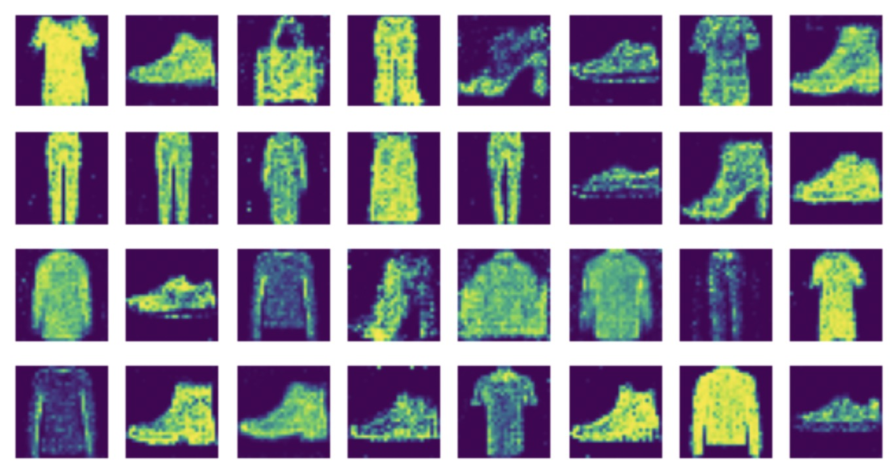

# GANs to Generate Grayscale Images of Clothing Items

This project implements a Generative Adversarial Network (GAN) to generate grayscale images of clothing items using the FashionMNIST dataset. GANs are a class of artificial intelligence algorithms used in unsupervised machine learning, consisting of two neural networks contesting with each other in a zero-sum game framework.

## Introduction
Generative Adversarial Networks (GANs) have gained popularity for their ability to generate realistic data samples, including images. This project focuses on generating grayscale images of clothing items, such as shirts, pants, dresses, and more, using GAN architecture.

## Features
- Utilizes FashionMNIST dataset for training.
- Preprocesses images using normalization transformations.
- Implements Generator and Discriminator models using fully connected neural network layers.
- Trains the GAN in epochs, with iterative training of the Generator and Discriminator.
- Visualizes generated fake samples during training to monitor progress.
- Converts trained Generator model to TorchScript and saves it for future use.
- Generates fake samples using the saved Generator model for evaluation.

## Getting Started
To run this project locally, follow these steps:
1. Clone this repository to your local machine.
2. Run the Jupyter notebook `Image generator.ipynb` to train the GAN and generate fake samples.

## Dataset
The FashionMNIST dataset consists of 60,000 training images and 10,000 testing images of grayscale clothing items. Each image is 28x28 pixels.

## Results

*Generated grayscale images of clothing items generated by the trained GAN.*
